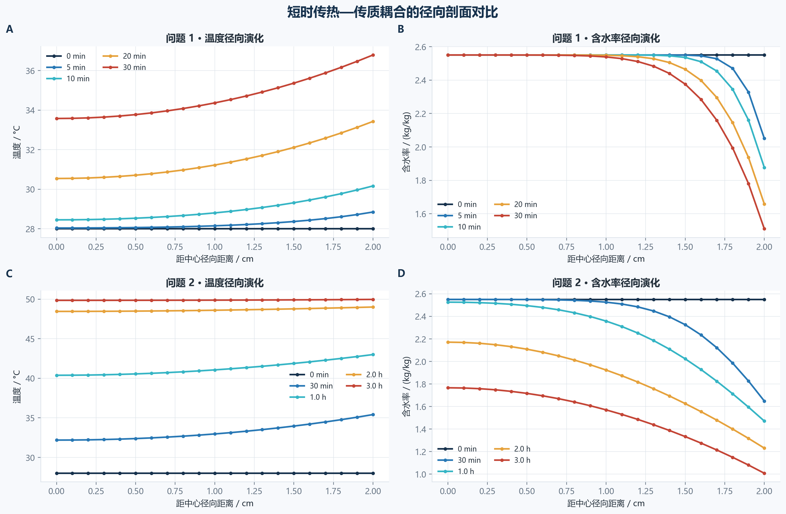
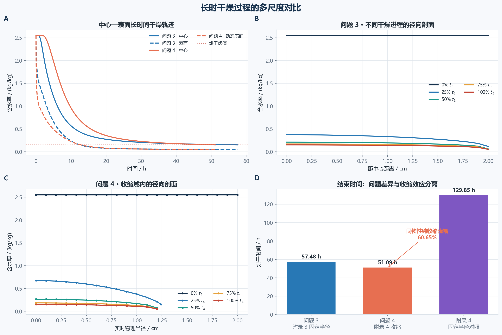
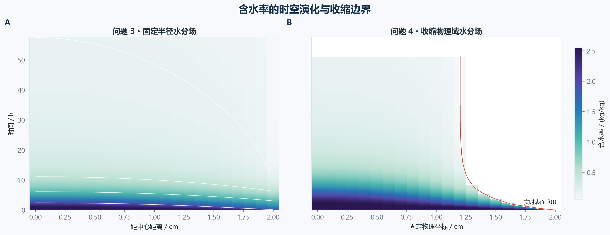
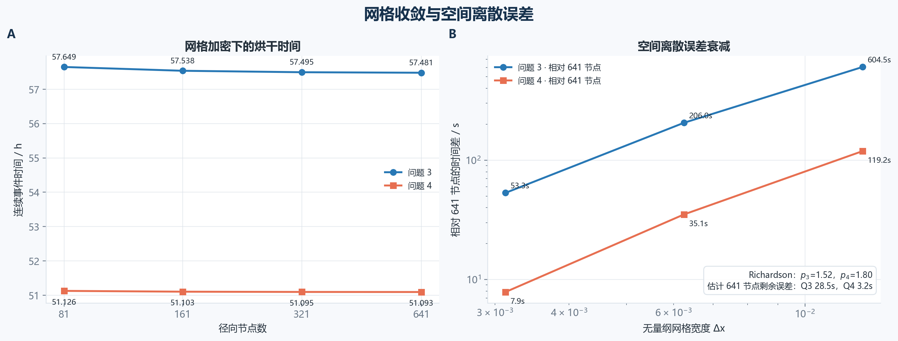
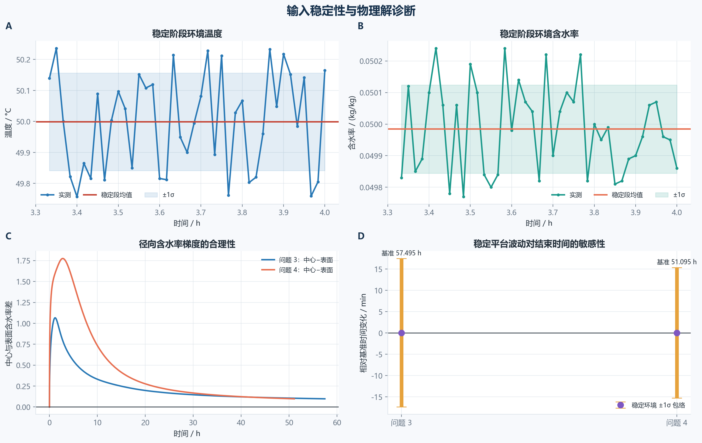
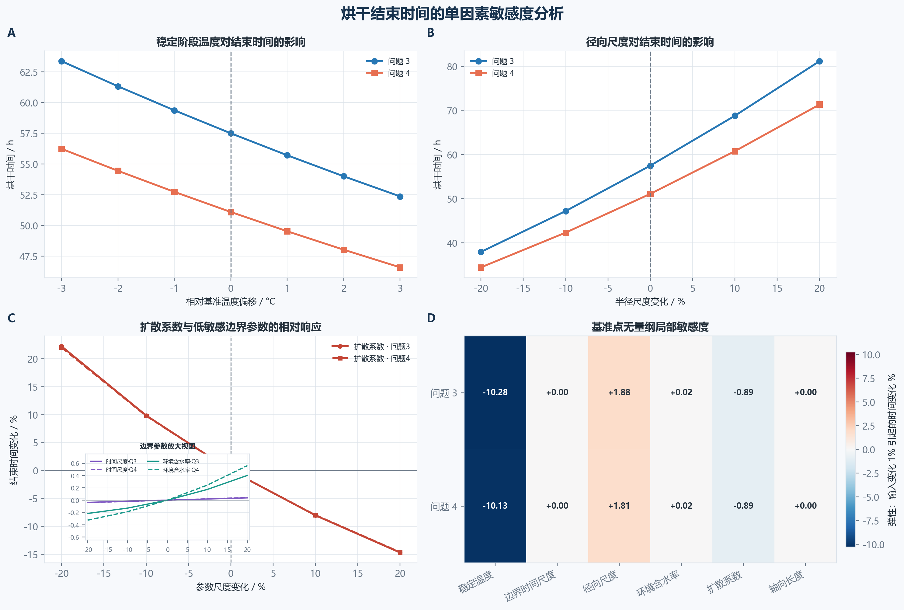

# 2026 高教社杯 A 题：药材的烘干问题

本仓库给出四问的统一机理模型、Python 数值求解代码，以及按官方模板生成的完整结果文件。模型保持一维径向传热、传质主线；问题 1、2 使用 321 个径向节点，问题 3、4 经网格无关性验证后使用 641 个径向节点。

官方题面来源：[全国大学生数学建模竞赛官网](https://www.mcm.edu.cn/html_cn/node/27b6e148f8113f09b0269f64a02629fb.html)。

分题思路与公式说明：

- [问题 1：常物性条件下 30 分钟温度场与水分场](docs/problem1.md)
- [问题 2：变物性条件下 3 小时温度场与水分场](docs/problem2.md)
- [问题 3：固定半径条件下烘干结束时间](docs/problem3.md)
- [问题 4：材料坐标下的半径收缩烘干模型](docs/problem4.md)
- [数值误差与模型合理性分析](docs/error_and_reasonableness.md)
- [温度、时间尺度与几何参数敏感度分析](docs/sensitivity_analysis.md)
- [论文写作思路与章节安排](docs/paper_writing_guide.md)

## 一、模型假设

1. 药材近似为均匀长圆柱，忽略端部效应，只研究轴向中部截面的径向传热、传质；温度与干基含水率只依赖半径 `r` 和时间 `t`。
2. 初始温度、含水率分别均匀为 `28 °C`、`2.55 kg/kg`，内部无体热源。
3. 题目未提供蒸发潜热、吸附等温线等参数，因此不增设这些经验项；附录 2、3、4 的 `ρ(C)、cp(C)、k(C)、D(C,T)` 公式保持不变。
4. 表面采用第三类换热、传质边界，`h=25 W/(m²·K)`，`hm=8×10⁻⁷ m/s`。
5. 附件 1 数据区间内采用分段线性插值；`14400 s` 后采用 `12000~14400 s` 稳定段的自动计算均值：`T_const=49.99875610 °C`、`C_const=0.04998415 kg/kg`。
6. 问题 4 中附件 2 的 `R(t)` 在数据区间内分段线性插值，数据结束后保持末值。`x=r/R(t)` 被定义为随固体骨架运动的材料坐标，而非固定空间坐标，因此不额外添加收缩对流项。

## 二、控制方程与边界条件

圆柱坐标下的一维径向非稳态热传导方程为

```text
ρ(C) cp(C) ∂T/∂t = (1/r) ∂/∂r [r k(C) ∂T/∂r]
```

水分场采用变扩散系数 Fick 第二定律：

```text
∂C/∂t = (1/r) ∂/∂r [r D(C,T) ∂C/∂r]
```

中心对称与表面 Robin 边界为

```text
∂T/∂r(0,t)=0,  ∂C/∂r(0,t)=0
k ∂T/∂r(R,t)=h[T∞(t)-Ts]
D ∂C/∂r(R,t)=hm[C∞(t)-Cs]
```

温度场用摄氏度积分；仅在 Arrhenius 指数 `exp(-3850/T)` 中使用 `T_K=T_C+273.15`。问题 3、4 的结束判据均为全空间 `max C(r,t)≤0.15 kg/kg`，没有把中心点写死为唯一判据。

问题 4 在材料坐标下，半径变化通过扩散、导热尺度 `1/R(t)²` 以及表面 Robin 边界中的 `R(t)` 进入模型。

## 三、数值方法

- 空间采用保留圆柱几何权重的守恒型节点有限体积法。
- 时间采用 `scipy.solve_ivp(method="BDF")`，最大内部步长 60 s，`rtol=2×10⁻⁶`、`atol=2×10⁻⁸`，并提供块三对角雅可比稀疏结构。
- 非线性界面物性先取 `C_face=(C_i+C_{i+1})/2`、`T_face=(T_i+T_{i+1})/2`，再计算 `k(C_face)`、`D(C_face,T_face)`。
- 问题 3、4 采用两遍求解：第一遍用终止事件取得连续精确烘干时刻，第二遍求至其后首个 60 s 整点。Excel 时间列严格为 `0,60,120,...`，连续事件时刻只写入 `intermediate/summary.json`。
- 运行结束自动检查初值、NaN/Inf、温度范围、含水率非负、中心/表面含水率关系、事件阈值和问题 4 半径数据一致性；失败即抛出 `RuntimeError` 并停止导出。

### 网格无关性分析

| 径向节点数 | 问题 3/h | 问题 4/h |
|---:|---:|---:|
| 81 | 57.648612 | 51.126092 |
| 161 | 57.537932 | 51.102741 |
| 321 | 57.495499 | 51.095162 |
| 641（正式） | 57.480707 | 51.092979 |

从 321 加密到 641 节点，问题 3、4 分别变化约 53.25 s、7.86 s，因此正式结果采用 641 节点，不再将 161 节点视为最终精度。

在同一环境与 161 节点条件下，新界面状态法相对旧“节点系数算术平均法”使问题 3、4 的时长分别变化约 `+528.62 s`、`+100.38 s`。问题 3 的差异不可忽略，故本仓库统一采用物理意义更直接的界面状态法，并重新完成上述网格收敛。

## 四、四问结果

### 问题 1：30 分钟内温度（°C）

| 时间/s | 0 cm | 0.5 cm | 1 cm | 1.5 cm | 2 cm |
|---:|---:|---:|---:|---:|---:|
| 100 | 28.0001 | 28.0003 | 28.0040 | 28.0327 | 28.1801 |
| 300 | 28.0408 | 28.0635 | 28.1514 | 28.3680 | 28.8481 |
| 600 | 28.4533 | 28.5360 | 28.8039 | 29.3161 | 30.1661 |
| 900 | 29.3243 | 29.4583 | 29.8755 | 30.6161 | 31.7306 |
| 1200 | 30.5427 | 30.7097 | 31.2223 | 32.1125 | 33.4271 |
| 1500 | 31.9957 | 32.1867 | 32.7660 | 33.7461 | 35.1205 |
| 1800 | 33.5753 | 33.7719 | 34.3640 | 35.3619 | 36.7852 |

### 问题 1：30 分钟内水分浓度（kg/kg）

| 时间/s | 0 cm | 0.5 cm | 1 cm | 1.5 cm | 2 cm |
|---:|---:|---:|---:|---:|---:|
| 100 | 2.5500 | 2.5500 | 2.5500 | 2.5500 | 2.2472 |
| 300 | 2.5500 | 2.5500 | 2.5500 | 2.5492 | 2.0509 |
| 600 | 2.5500 | 2.5500 | 2.5500 | 2.5353 | 1.8770 |
| 900 | 2.5500 | 2.5500 | 2.5497 | 2.5045 | 1.7547 |
| 1200 | 2.5500 | 2.5500 | 2.5482 | 2.4646 | 1.6586 |
| 1500 | 2.5500 | 2.5499 | 2.5445 | 2.4206 | 1.5787 |
| 1800 | 2.5500 | 2.5497 | 2.5383 | 2.3755 | 1.5102 |

### 问题 2：3 小时内温度（°C）

| 时间/h | 0 cm | 0.5 cm | 1 cm | 1.5 cm | 2 cm |
|---:|---:|---:|---:|---:|---:|
| 0.5 | 32.1892 | 32.3820 | 32.9658 | 33.9605 | 35.4129 |
| 1.0 | 40.3814 | 40.5534 | 41.0604 | 41.8782 | 42.9974 |
| 1.5 | 45.8468 | 45.9349 | 46.1931 | 46.6051 | 47.1400 |
| 2.0 | 48.4506 | 48.4884 | 48.5987 | 48.7738 | 49.0037 |
| 2.5 | 49.4668 | 49.4791 | 49.5136 | 49.5654 | 49.6604 |
| 3.0 | 49.8498 | 49.8556 | 49.8749 | 49.9104 | 49.9665 |

### 问题 2：3 小时内水分浓度（kg/kg）

| 时间/h | 0 cm | 0.5 cm | 1 cm | 1.5 cm | 2 cm |
|---:|---:|---:|---:|---:|---:|
| 0.5 | 2.5499 | 2.5489 | 2.5256 | 2.3257 | 1.6486 |
| 1.0 | 2.5257 | 2.4948 | 2.3578 | 2.0230 | 1.4711 |
| 1.5 | 2.3861 | 2.3256 | 2.1344 | 1.8020 | 1.3476 |
| 2.0 | 2.1709 | 2.1084 | 1.9236 | 1.6259 | 1.2311 |
| 2.5 | 1.9566 | 1.9006 | 1.7360 | 1.4720 | 1.1166 |
| 3.0 | 1.7662 | 1.7165 | 1.5702 | 1.3333 | 1.0081 |

### 问题 3：固定半径烘干

连续事件检测得到烘干结束时刻为 **206930.545593 s，即 57.480707 h**。`result3.xlsx` 最后一行是其后的首个 60 s 整点 `206940 s`。

| 时间/h | 0 cm | 0.5 cm | 1 cm | 1.5 cm | 2 cm |
|---:|---:|---:|---:|---:|---:|
| 6 | 1.0170 | 0.9881 | 0.9015 | 0.7550 | 0.5328 |
| 12 | 0.4561 | 0.4432 | 0.4031 | 0.3297 | 0.1642 |
| 18 | 0.2988 | 0.2916 | 0.2687 | 0.2253 | 0.0845 |
| 24 | 0.2378 | 0.2327 | 0.2167 | 0.1856 | 0.0665 |
| 30 | 0.2058 | 0.2018 | 0.1892 | 0.1641 | 0.0598 |
| 36 | 0.1859 | 0.1825 | 0.1718 | 0.1504 | 0.0566 |
| 42 | 0.1721 | 0.1691 | 0.1597 | 0.1407 | 0.0548 |
| 48 | 0.1618 | 0.1592 | 0.1507 | 0.1334 | 0.0537 |
| 54 | 0.1539 | 0.1515 | 0.1436 | 0.1277 | 0.0530 |
| 57.480707 | 0.1500 | 0.1477 | 0.1402 | 0.1249 | 0.0526 |

### 问题 4：考虑半径收缩

连续事件检测得到烘干结束时刻为 **183934.724387 s，即 51.092979 h**，此时半径为 **1.200000 cm**。`result4.xlsx` 最后一行是其后的首个 60 s 整点 `183960 s`。

| 时间/h | 0 cm | 0.5 cm | 1 cm | 药材表面 |
|---:|---:|---:|---:|---:|
| 6 | 1.7196 | 1.5378 | 1.0226 | 0.4207 |
| 12 | 0.7377 | 0.6546 | 0.4083 | 0.1669 |
| 18 | 0.4088 | 0.3687 | 0.2397 | 0.0892 |
| 24 | 0.2851 | 0.2611 | 0.1790 | 0.0673 |
| 30 | 0.2263 | 0.2094 | 0.1493 | 0.0595 |
| 36 | 0.1928 | 0.1797 | 0.1317 | 0.0559 |
| 42 | 0.1712 | 0.1604 | 0.1200 | 0.0541 |
| 48 | 0.1562 | 0.1468 | 0.1116 | 0.0530 |
| 51.092979 | 0.1500 | 0.1413 | 0.1081 | 0.0526 |

`result4.xlsx` 保留 `0~2 cm` 的固定物理坐标；某坐标越过实时表面后写空值，并另设始终取 `x=1` 的“药材表面”动态列。

### 收缩效应对照

问题 3 使用附录 3 物性，问题 4 使用附录 4 物性，因此二者从 `57.480707 h` 变为 `51.092979 h` 的 **11.1128%** 差异不能全部归因于收缩。

为隔离几何因素，使用完全相同的附录 4 物性作对照：

| 附录 4 对照 | 烘干时间/h |
|---|---:|
| 固定 `R=2 cm` | 129.853389 |
| 附件 2 收缩 `R(t)` | 51.092979 |

由 `(t_fixed-t_shrink)/t_fixed` 得到纯几何收缩对应的时间降幅为 **60.653334%**。该结论只比较同一套附录 4 物性，不混入问题 3 与问题 4 的物性差异。

## 五、数据图与诊断图

### 短时径向温度—水分剖面



### 长时干燥与收缩效应对比



### 含水率时空场与收缩边界



### 网格收敛与离散误差



### 环境稳定性与物理解诊断



### 温度、时间尺度与几何参数敏感度



每张图同时提供 PNG 和可编辑 SVG 版本。详细误差公式、数值表和适用边界见 [数值误差与模型合理性分析](docs/error_and_reasonableness.md)。

## 六、仓库结构与运行

```text
src/model.py                 控制方程、物性、有限体积离散和 BDF 求解
src/problem1.py              独立求解问题 1，输出 result1.json
src/problem2.py              独立求解问题 2，输出 result2.json
src/problem3.py              独立求解问题 3，输出 result3.json
src/problem4.py              独立求解问题 4，输出 result4.json
src/problem_utils.py         四问共用的输出、半径读取和合理性检查
src/convergence.py           81/161/321/641 节点网格无关性分析
src/run_all.py               四问总入口、收敛分析、对照实验和摘要汇总
export_results.mjs           将中间结果写入官方 Excel 模板
intermediate/summary.json    连续事件时刻、对照结果和诊断摘要
results/grid_convergence.csv 网格收敛数据
results/result1~result4.xlsx 官方格式结果文件
src/analyze_errors.py          空间、时间误差与环境敏感性分析
src/generate_figures.py        生成论文级 PNG/SVG 多面板图
src/sensitivity_analysis.py    温度、时间尺度、半径及传质参数扫描
figures/                       正式数据图及可编辑矢量版本
```

运行完整数值流程：

```powershell
python -m pip install -r requirements.txt
python src/run_all.py
```

也可以只运行某一问；每个入口只更新该问对应的中间结果：

```powershell
python src/problem1.py
python src/problem2.py
python src/problem3.py
python src/problem4.py
```

四个分题文件调用同一份 `src/model.py`，因此没有复制控制方程或改变模型。问题 3、4 在各自文件中仍保留“事件定位 + 规则 60 s 输出”的两遍求解逻辑。

导出 Excel（需要 Node.js 和 `@oai/artifact-tool`）：

```powershell
npm install
npm run export
```

生成误差分析与论文数据图：

```powershell
python src/analyze_errors.py
python src/generate_figures.py
python src/sensitivity_analysis.py
```

`python src/run_all.py` 会在控制台打印稳定环境均值、四档网格结果、最终时长和收缩对照，并生成所有 `intermediate/*.json` 与 `results/grid_convergence.csv`。Excel 导出只消费这些中间结果，避免人工抄写造成不一致。
