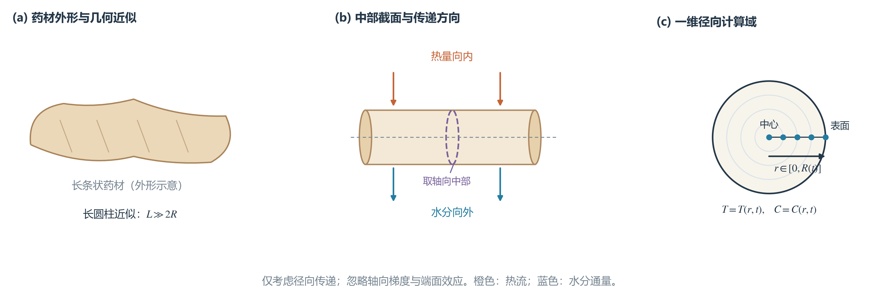
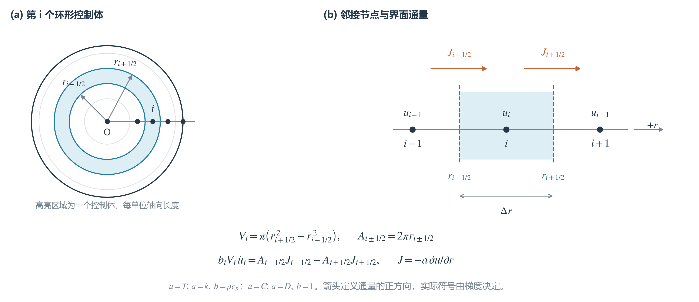
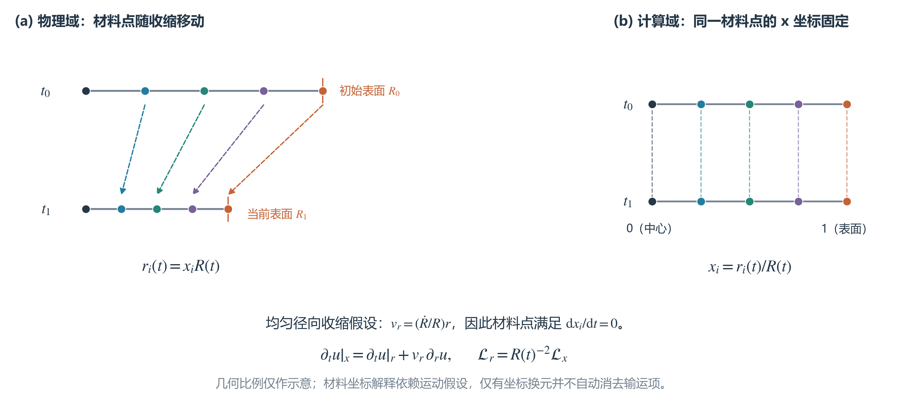
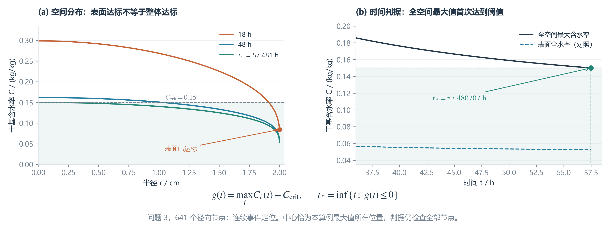

# 论文插图使用建议

现有插图分为概览图（07–11）和正文推导图（12–15），均提供 PNG 和 SVG。正文建议优先采用 12–15，它们分别解释模型假设、空间离散、材料坐标和结束判据；07–11 可按篇幅选作概览。

`src/generate_illustrations.py` 生成 07–11；`src/generate_method_figures.py` 生成 12–15。后一组 SVG 保留文本对象，编辑时需安装 Microsoft YaHei 或替换为合适的中文字体。

## 正文推导图：参考优秀论文的表达方式

参考公开论文[《基于动态搜索的“板凳龙”运动状态及路线研究》](https://github.com/cny123222/CUMCM-2024A-Bench-Dragon/blob/main/OurPaper.pdf)中的表达逻辑：第 6 页用几何示意定义公式变量，第 11 页放大关键局部，第 12 页解释事件搜索，第 13 页将空间状态与时间阈值配对验证。下列四图均为本题重新绘制，不复制参考论文的图像或数据。

| 文件编号 | 建议图题 | 建议位置 | 回答的问题 |
|---|---|---|---|
| 12 | 药材几何近似与一维径向模型的建立 | 模型假设之后 | 为什么可以从实物简化到一维？ |
| 13 | 环形控制体及相邻界面通量示意图 | 有限体积离散公式之前 | 圆柱权重和通量差从何而来？ |
| 14 | 均匀径向收缩下的材料点与计算节点对应关系 | 问题 4 坐标变换处 | 固定 x 在物理上意味着什么？ |
| 15 | 径向含水率分布与全空间烘干事件判据 | 问题 3 结果解释处 | 为什么表面达标还不能结束？ |

### 图 12：从对象到模型



图注建议：药材外形仅为长条状物体的概念示意，不代表实测轮廓或特定药材品种。在长圆柱及忽略端部效应假设下，研究中部截面的径向温度和干基含水率。橙色表示加热时的向内热流，蓝色表示干燥时的向外水分通量。

### 图 13：局部控制体与离散方程



图注建议：以固定半径模型为例，高亮环带对应节点 i 的控制体。所有体积与界面面积均按每单位轴向长度计。J 的正方向定义为径向向外，净输入等于内界面输入减外界面输出；对温度取 u=T、a=k、b=ρcp，对含水率取 u=C、a=D、b=1。

说明：含水率方程的体积加权式对应本仓库采用的扩散方程，不应仅由此图宣称收缩过程中的真实总水质量已得到独立守恒验证。

### 图 14：材料坐标需要运动假设



图注建议：同色点表示同一材料点。在均匀径向收缩 v_r=(R'/R)r 假设下，物理坐标 r_i 随 R(t) 缩小，而 x_i=r_i/R(t) 保持不变。左右面板的连线分别展示物理节点的移动和计算节点的固定。

这里必须区分“坐标换元”与“采用材料导数的建模假设”：单纯令 x=r/R(t)，并不能自动删去从固定空间偏导换元所出现的输运项。图中比例为示意，不作为附件 2 的拟合结果。

### 图 15：空间状态与时间阈值配对验证



图注建议：问题 3 的 641 节点数值解。左图给出 18 h、48 h 和连续事件时刻的径向含水率分布；右图将全空间最大含水率与表面含水率对照。浅绿色区域表示不高于 0.15 kg/kg，结束判据为 g(t)=max_i C_i(t)−0.15 首次达到零。

18 h 的表面已经低于阈值，但中心仍高于阈值，因此不能按表面值宣布结束。曲线由连续数值解直接采样，不外推事件后的解。当前事件时间为 57.480707 h，绘图脚本会与 `intermediate/summary.json` 核对，偏差超过 1 s 即停止生成；核验摘要保存在 `figures/method_figures_validation.json`。

## 概览插图（07–11）

## 图 1：药材长圆柱近似与径向传热—传质模型

- 文件：`figures/07_physical_model_schematic.png`（矢量版为同名 SVG）
- 建议位置：模型假设之后、控制方程之前。
- 建议图题：**图 X 药材长圆柱近似及一维径向传热—传质模型示意图**
- 正文衔接：药材轴向长度明显大于其截面半径，因此忽略端部效应和轴向梯度，仅研究轴向中部截面内的径向传热与水分迁移。

## 图 2：收缩物理域与材料坐标映射

- 文件：`figures/08_material_coordinate_mapping.png`（矢量版为同名 SVG）
- 建议位置：问题 4 的坐标变换公式之后。
- 建议图题：**图 X 收缩圆柱物理域到固定材料坐标域的映射关系**
- 正文衔接：令材料坐标 $x=r/R(t)$，可将随时间收缩的区间 $[0,R(t)]$ 映射为固定区间 $[0,1]$；同一材料点的 $x$ 坐标保持不变，而其物理位置 $r=xR(t)$ 随半径减小而向内移动。

## 图 3：四问建模框架与数据流

- 文件：`figures/09_model_framework.png`（矢量版为同名 SVG）
- 建议位置：模型建立章节开头或“总体思路”小节。
- 建议图题：**图 X 四个问题的递进式建模框架与数据流**
- 正文衔接：四个问题共享一维径向传热—传质控制方程，并依次引入变物性、达标事件判定和收缩几何，从而形成由基础场验证到实际干燥时间预测的递进式建模过程。

## 图 4：药材干燥过程概览

- 文件：`figures/10_drying_process_overview.png`（矢量版为同名 SVG）
- 建议位置：摘要之后、问题重述或模型总体思路开头。
- 建议图题：**图 X 药材升温、脱水与尺寸收缩过程概览**
- 正文衔接：干燥初期药材温度和含水率近似均匀；加热后热量从表面向中心传递、水分从内部向表面迁移，并逐渐形成径向梯度；当全空间最大含水率不高于阈值时判定烘干结束。

## 图 5：模型关键发现概览

- 文件：`figures/11_key_findings_summary.png`（矢量版为同名 SVG）
- 建议位置：结论章节开头，或作为答辩展示中的总结页。
- 建议图题：**图 X 药材干燥模型的主要定量发现**
- 正文衔接：模型结果可归纳为温度趋稳、水分由表及里逐步降低、半径持续收缩和结束时间对温度与径向尺度高度敏感四个方面。

图 4、图 5 中的正式结果数字由 `intermediate/summary.json` 自动读取；更新模型结果后重新运行脚本即可同步更新插图。

## 重新生成

在仓库根目录运行：

```bash
python src/generate_illustrations.py
python src/generate_method_figures.py
```

`generate_illustrations.py` 读取现有摘要生成概念图；`generate_method_figures.py` 会额外求解一次问题 3，用于生成图 15 并核对正式事件时刻。两个入口都不覆盖原有数值结果。`run_analysis.py` 已接入两组图的生成流程。
