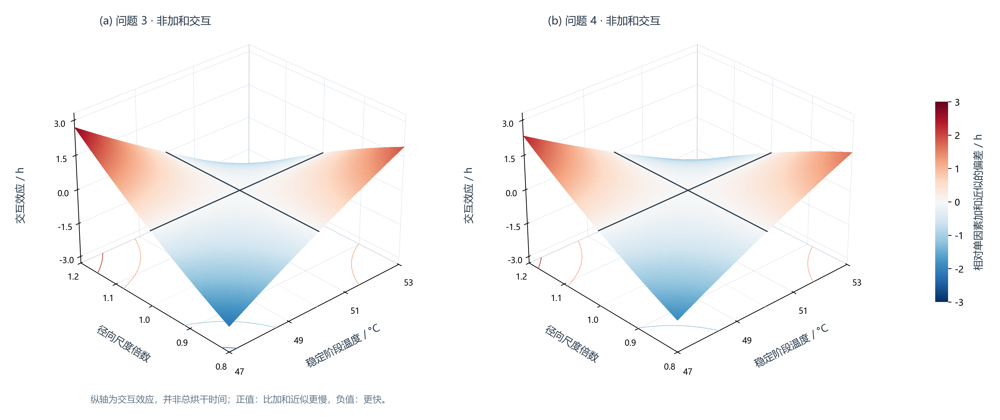
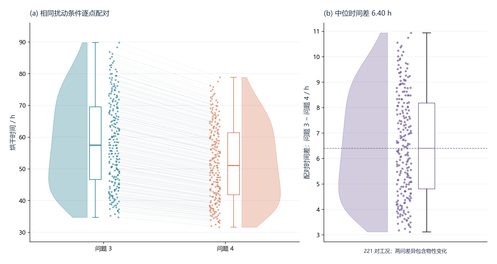
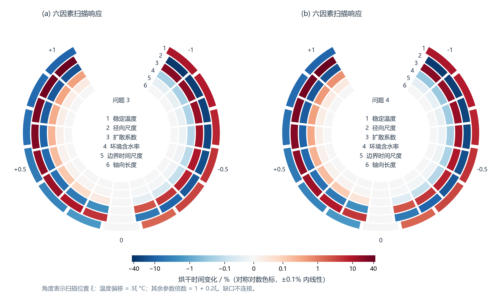
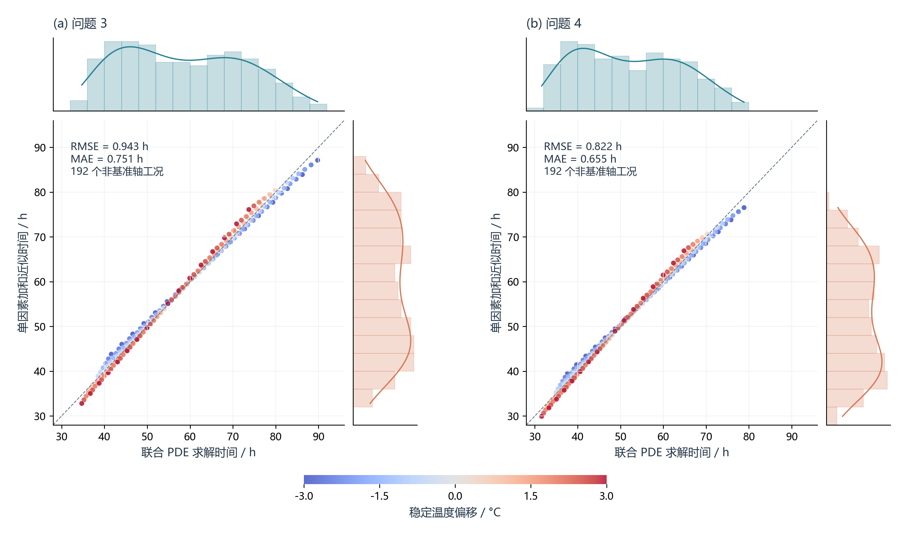
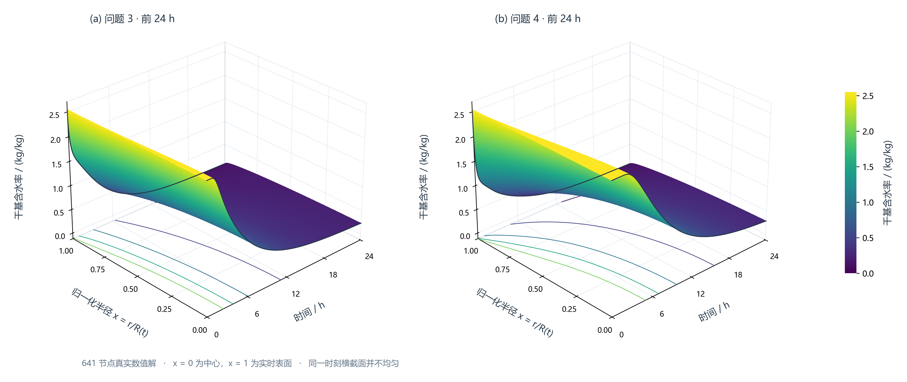

# 参考图样式适配与论文选图

## 1. 原三维图为什么接近平面？

图 16 的高度是总烘干时间，扫描区间为稳定温度 ±3 °C、径向尺度 0.8~1.2 倍。
对原始 221 个工况作最小二乘平面 `t=a+bΔT+cs_R` 拟合，结果为：

| 描述性指标 | 问题 3 | 问题 4 |
|---|---:|---:|
| 平面对总时长变化的解释比例 R² | 0.993324 | 0.993099 |
| 总时长极差 / h | 55.0872 | 47.2687 |
| 相对平面的最大偏离 / h | 4.0792 | 3.5335 |

因此它不是严格平面，但本区间主要表现为两个参数的单调主效应，曲率相对于总变化较小。绘图代码使用真实双参数求解和保形插值，并没有把数据替换成平面。

参考 TPE 模板的峰谷是模拟调参响应，不能直接移植到物理模型。原图 16 保留用于报告绝对时长；新增图 18 改画**交互效应**，新增图 22 改画**含水率时空场**，更容易看清真实非线性。二者的纵轴含义与图 16 不同。

## 2. 参考样式适配表

| 参考样式 | 本仓库适用性 | 本次处理 |
|---|---|---|
| 01 SHAP 组合图 | 目前没有训练模型及已计算的 SHAP 值 | 不把敏感度冒充 SHAP |
| 02 配对云雨图 | 两问有相同温度、尺度组合的 221 对工况 | 图 19，半小提琴 + 箱线 + 配对点 |
| 03 ROC + CI | 没有分类标签、概率预测与重复验证 | 不画，不能虚构 ROC 或置信带 |
| 04 多模型泰勒图 | 可用于未来网格/替代模型的完整场对照，但现有事件时长汇总不足 | 本次保留已有收敛图，不为图型新增无关模型 |
| 05 相关矩阵组合 | 联合扫描是人为全因子设计，两个输入独立取点 | 相关矩阵信息有限，优先画实际交互 |
| 06 预测—真实边缘分布图 | 可改为“加和近似—联合 PDE 解”，不具备实验真值 | 图 21，不使用 Train/Test 或实验准确率标签 |
| 07 三维曲面 | 交互效应和时空场存在可解释的非线性 | 图 18、22；不声称 TPE 优化 |
| 08 相关矩阵 + 半边小提琴 | 可以展示工况分布，但相关部分没有额外论证价值 | 采用图 19 的半小提琴，不重复堆图 |
| 09 分组环形热图 | 六参数单因素扫描，可按两问分组 | 图 20，编码原始时间变化百分比 |
| 10 堆叠 + 云雨 + 箱线 | 其中的分布比较适用，但参数效应并非可直接堆叠 | 保留云雨/箱线部分，不堆叠非加和贡献 |
| 11 和弦图 | 没有相应网络边、双向流量或转移矩阵 | 不画装饰性连线 |

## 3. 已生成的五组图

### 图 18：非加和交互效应三维曲面



采用与图 17 相同的量：

$$
I(\Delta T,s_R)=t(\Delta T,s_R)-t(\Delta T,1)-t(0,s_R)+t(0,1).
$$

图上鞍形来自真实联合响应减去基准单因素加和近似，不是对原时长进行任意变形。黑线对应 `ΔT=0`、`s_R=1`，其交互量按定义为零。适合敏感度章节，图 17 的二维等高线版本更利于精确读数，正文可二选一。

### 图 19：联合工况的配对云雨图



相同温度、径向尺度的两问逐点配对，全部 221 对均保留。半小提琴是工况分布的描述性核密度，箱体为四分位区间、中线为中位数、须为 1.5 IQR 规则；散点仍显示所有工况。横向抖动使用固定随机种子，仅为避让，不改变纵轴值。

本扫描中问题 3 减问题 4 的中位时间差为 `6.4003 h`，范围 `3.1168~10.9354 h`。这些是人为设定的等权扫描工况，不是 221 次随机实验，也不是实验不确定性分布。两问物性与几何均不同，不能将时间差直接称为纯收缩效应。

### 图 20：六因素分组环形热图



颜色是原 196 条单因素扫描记录的烘干时间变化百分比。外圈至内圈依次为温度、径向尺度、扩散系数、环境含水率、边界时间尺度、轴向长度。温度环有 13 个真实单元，其余各 17 个；未插值增加“测点”。

角位置为无量纲扫描位置 `ξ`：温度偏移 `3ξ °C`，其他参数倍数 `1+0.2ξ`。它不是同等物理幅度，不据此宣称绝对重要性排序。为同时辨认约 0.02% 与数十个百分点的响应，采用对称对数色标，±0.1% 内线性；颜色距离不是线性百分比距离。缺口表示扫描两端不具有周期关系。此图适合概括展示，精确比较仍以图 6 和数值表为准。

### 图 21：加和近似与联合求解的边缘分布图



横轴为联合 PDE 时长，纵轴为 `t_add=t(ΔT,1)+t(0,s_R)−t(0,1)`。排除按定义相等的两个基准截线，每问剩 192 个工况。边缘分布是这些工况的描述性分布，颜色表示稳定温度偏移，虚线是 1:1。

| 相对于联合 PDE 的加和近似误差 | 问题 3 | 问题 4 |
|---|---:|---:|
| RMSE / h | 0.943039 | 0.822109 |
| MAE / h | 0.751122 | 0.655460 |
| 最大绝对误差 / h | 2.696891 | 2.334797 |

图中“参考”仍是同一模型的联合求解，不是实测真值；这些误差不能写成药材干燥预测的实验精度。

### 图 22：前 24 小时的含水率时空曲面



重新运行两问正式 641 节点模型，核对连续烘干事件与已发布摘要相差不超过 1 s。展示前 24 h，采用 181 个时间样本，初期按平方时间网格加密；时间轴仍按小时线性展示。缓存保存 161 个径向采样位置，实际绘图隔点取 81 个。

两个面板统一范围与色标。纵向位置采用 `x=r/R(t)`，`x=0` 为中心、`x=1` 为实时表面，收缩时并非固定物理半径。颜色与高度均表示干基含水率 kg/kg。此图的弯曲体现内部水分迁移及空间非均匀性，是本轮更适合放进正文的三维图。

## 4. 代码、记录与复现

```powershell
python src/generate_reference_figures.py
# 只改样式时复用来源及文件哈希匹配的时空场，不重新求解：
python src/generate_reference_figures.py --plot-only
```

- `src/generate_reference_figures.py`：全部五组图的生成入口及中文注释。
- `results/joint_sensitivity_sweep.csv`：图 18、19、21 的联合工况来源。
- `results/sensitivity_sweep.csv`：图 20 的六因素来源。
- `results/reference_moisture_fields.npz` 与同名 JSON：图 22 的实际时空场、模型哈希、单位及事件核对。
- `results/reference_figure_diagnostics.json`：平面近似、配对差、加和误差等可追溯指标。
- `results/figure_source_compatibility.json`：发布前与正式模型的逐工况复算核对记录。
- 图 18~22 均有 PNG、可编辑 SVG、矢量 PDF；核心模型和正式 Excel 不变。

缓存最初由包含额外诊断分支的本地代码生成，但调用的始终是默认材料坐标模型。发布前独立载入 Git 提交 `88ecee9` 的正式模型，复算全部 460 个联合工况以及两问 641 节点时空场；保存采样点上的含水率、烘干时间和事件残差的最大差异均为 0。元数据保留原始生成指纹，并额外登记经过核对的正式模型完整来源指纹，允许两者复用缓存；其他未验证的代码或附件变动仍会被拒绝。这是计算实现一致性检查，不是实验验证。

优先选图 22（物理过程）、图 18 或 17（联合敏感度），图 19~21 作为对比与附录备选，不必把所有图都塞进正文。
