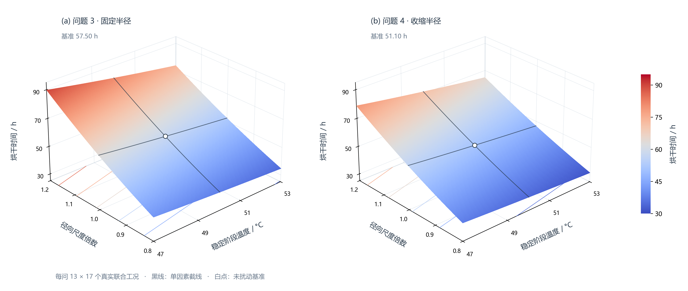
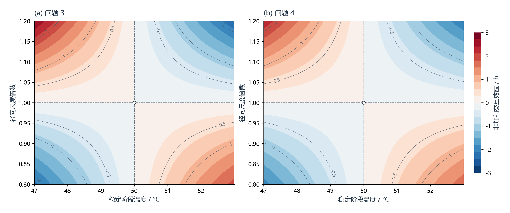

# 参数敏感度分析

## 1. 分析目的与口径

问题 3、4 的烘干结束时间由环境边界、材料扩散能力和药材尺度共同决定。为判断各项假设对结论的影响，本节采用**单因素确定性扫描**：每次只改变一个参数，其余参数保持基准值，重新求解连续事件

$$
\max_{0\le x\le 1} C(x,t_{\mathrm{dry}})=0.15.
$$

敏感度计算采用 321 个径向节点。该网格相对 641 节点的时间差仅为问题 3 的 53.25 s 和问题 4 的 7.86 s，足以稳定识别参数响应趋势；论文中的正式结束时间仍使用 641 节点结果。

本分析不是概率抽样，也不把扫描区间解释为置信区间。输入扰动定义如下：

| 参数 | 扫描范围 | 物理含义 |
|---|---:|---|
| 稳定阶段温度 | 基准值 $\pm3\ ^\circ\mathrm C$，间隔 $0.5\ ^\circ\mathrm C$，共 13 点 | 只改变 14400 s 后的稳定温度，附件 1 实测段不变 |
| 边界时间尺度 | $0.8\sim1.2$ 倍，间隔 0.025，共 17 点 | 整体伸缩附件 1 的时间轴，观测值本身不变 |
| 径向尺度 | $0.8\sim1.2$ 倍，间隔 0.025，共 17 点 | 问题 3 缩放固定半径，问题 4 等比例缩放完整 $R(t)$ 曲线 |
| 稳定环境含水率 | $0.8\sim1.2$ 倍，间隔 0.025，共 17 点 | 只改变稳定阶段的环境含水率 |
| 水分扩散系数 | $0.8\sim1.2$ 倍，间隔 0.025，共 17 点 | 缩放 $D(C,T)$ 的整体量级，函数形状不变 |
| 轴向长度 | $0.8\sim1.2$ 倍，间隔 0.025，共 17 点 | 检查长圆柱假设下的结构敏感度 |

附件 1、附件 2 原始数据均保持只读。两个问题合计输出 196 条扫描记录，所有曲线点均来自独立求解，不使用绘图插值，也不会修改官方结果文件。

## 2. 敏感度指标

对具有明确比例尺度的参数 $p$，采用基准点附近的无量纲弹性

$$
E_p=\frac{p_0}{t_0}\frac{\partial t}{\partial p}
\approx
\frac{t(1.1p_0)-t(0.9p_0)}{0.2t_0}.
$$

$E_p$ 表示参数增加 1% 时，烘干时间约改变 $E_p\%$。温度不能用摄氏度直接构造比例，因此用绝对温度 $T_K$ 归一化：

$$
E_T=\frac{T_{K,0}}{t_0}\frac{\partial t}{\partial T},
\qquad
\frac{\partial t}{\partial T}
\approx\frac{t(T_0+1)-t(T_0-1)}{2}.
$$

## 3. 基准结果

| 工况 | 321 节点基准时间/h | 641 节点正式时间/h |
|---|---:|---:|
| 问题 3 | 57.495499 | 57.480707 |
| 问题 4 | 51.095162 | 51.092979 |

敏感度分析基准与既有网格收敛结果一致，没有改动四问正式答案。

## 4. 标准扰动结果

温度使用 $\pm2\ ^\circ\mathrm C$，其他参数使用 $\pm10\%$。表中依次给出“低值扰动 / 高值扰动”导致的结束时间相对变化。

| 参数 | 问题 3 时间变化 | 问题 4 时间变化 | 局部弹性（问题3 / 问题4） |
|---|---:|---:|---:|
| 稳定阶段温度 | +6.651% / -6.082% | +6.555% / -6.001% | -10.275 / -10.133 |
| 边界时间尺度 | -0.018% / +0.018% | -0.020% / +0.021% | +0.002 / +0.002 |
| 径向尺度 | -17.923% / +19.733% | -17.215% / +18.985% | +1.883 / +1.810 |
| 稳定环境含水率 | -0.129% / +0.175% | -0.187% / +0.245% | +0.015 / +0.022 |
| 水分扩散系数 | +9.850% / -8.021% | +9.787% / -7.986% | -0.894 / -0.889 |
| 轴向长度 | 0 / 0 | 0 / 0 | 0 / 0 |

温度局部导数分别为

$$
\frac{\partial t_3}{\partial T}\approx-1.8282\ \mathrm{h}/^\circ\mathrm C,
\qquad
\frac{\partial t_4}{\partial T}\approx-1.6023\ \mathrm{h}/^\circ\mathrm C.
$$

## 5. 结果解释

1. **稳定温度是重要驱动因素。** 扩散系数包含 $\exp(-3850/T_K)$，温度升高会显著提高内部水分迁移速度，因此结束时间对温度呈明显负敏感。温度弹性使用绝对温度计算，不能将其误读为“摄氏温度增加 1%”；按本表设定的扰动幅度比较时，径向尺度 ±10% 的时间影响大于温度 ±2 °C，不能脱离尺度给出绝对排序。
2. **半径是主要几何因素。** 问题 3、4 的半径弹性分别约为 1.88 和 1.81，接近扩散特征时间 $R^2/D$ 所暗示的平方尺度关系；Robin 边界阻力和变物性使其不严格等于 2。
3. **扩散系数量级的重要性仅次于温度和半径。** 其弹性约为 -0.89，接近扩散控制过程的反比关系，但表面传质阻力使绝对值略小于 1。
4. **附件 1 前期过程的时间尺度影响很小。** 即使时间轴改变 $\pm10\%$，结束时间也只改变约 $\pm0.02\%$。原因是前期升温过程约 4 h，而完整干燥持续 50 h 以上，长期稳定边界占主导。
5. **稳定环境含水率在当前低湿范围内影响较弱。** 其变化会改变表面对流传质驱动力，但内部扩散仍是主要限制步骤。
6. **轴向长度的敏感度为零是模型结构结论。** 当前模型忽略轴向梯度和端面传热传质，控制方程中没有轴向长度 $L$。因此不能据此断言真实短圆柱也与长度无关；当长度与直径同量级时，应改用二维轴对称模型检验端部效应。

## 6. 图表与复现

图中将数量级差异明显的响应拆成六个独立面板。温度、半径、扩散系数和低敏感边界参数分别绘图；标准扰动区间用于比较非线性与正负扰动的不对称性；热图汇总基准点局部弹性。


运行：

```powershell
python src/sensitivity_analysis.py
```

若需连同误差分析和图 1~5 一并更新，运行：

```powershell
python src/run_analysis.py
```

若数值结果没有改变、只需调整图 6 排版，可直接读取已有 CSV 重画：

```powershell
python src/sensitivity_analysis.py --plot-only
```

脚本输出：

- `results/sensitivity_sweep.csv`：全部单因素扫描工况；
- `results/sensitivity_summary.json`：基准值、局部弹性和标准扰动摘要；
- `figures/06_parameter_sensitivity.png`：论文插图；
- `figures/06_parameter_sensitivity.svg`：可编辑矢量图。

敏感度排序适用于本题给定参数和扫描范围。若需要概率意义上的不确定性区间，还需给出各输入参数的分布或实测误差，再进行 Monte Carlo 或全局方差分解。

## 7. 双参数联合敏感度与三维曲面

新增温度与径向尺度的联合扫描，区别于把已有两条单因素曲线叠加：

- 温度：只改变 `14400 s` 后的稳定温度，偏移 `−3~+3 °C`、每 `0.5 °C` 一点，实测段不变。
- 径向尺度：`0.8~1.2` 倍、每 `0.025` 一点。问题 3 为 `R=0.02s_R m`，问题 4 为 `R(t)=s_R R_base(t)`；不是改变轴向长度。
- 每问 `13×17=221` 个真实 PDE 求解，两问共 442 个联合工况，使用 321 节点与原敏感度分析保持一致。另独立计算 18 个网格间验证点。
- 横纵轴是两个输入，曲面高度和颜色重复编码烘干时间；它是二维输入的三维响应曲面，不是全局高维敏感度或 TPE 调参结果。



两面板共用高度范围与色标。黑色截线为温度或半径保持基准时的单因素响应，白点为未扰动基准。`121×121` 绘图网格仅为保形插值加密，不计入真实工况数；网格间验证误差限设为 `0.05%`，并检查所有真实节点的事件阈值及趋势。

为辨别两参数效应是否可简单相加，定义非加和交互量：

$$
I(\Delta T,s_R)=t(\Delta T,s_R)-t(\Delta T,1)-t(0,s_R)+t(0,1).
$$



`I>0` 表示联合工况比两个单因素时间变化的简单相加更慢，`I<0` 表示更快。这是确定性有限扰动的非加和量，不是统计交互显著性或实验误差。不要将两问曲面的差异全部解释为收缩，因为物性也不同。

```powershell
python src/sensitivity_surface.py --workers 4
python src/sensitivity_surface.py --plot-only
python src/sensitivity_surface.py --check-only
```

数据：`results/joint_sensitivity_sweep.csv`；校验及来源哈希：`results/joint_sensitivity_summary.json`。图 16、17 均输出 PNG、SVG 与矢量 PDF。绘图形式参考本地科研模板的 `rf-tpe-surface`，但不使用模板模拟值，不为模仿峰谷而人为添加起伏。

本次 321 节点扫描中，问题 3、4 的时长范围分别为 `34.7087~89.7959 h` 和 `31.5919~78.8606 h`。最大非加和交互量绝对值分别为 `2.6969 h` 和 `2.3348 h`，表明联合影响并非严格可加。18 个独立网格间检查点的最大插值相对误差为 `0.000907%`；它只衡量绘图插值相对 PDE 解的误差，不是实验预测误差。

## 8. 三维图形态与参考样式扩展

总时长曲面接近平面是当前扫描范围的真实响应特征：平面拟合对两问网格时长变化的描述性 R² 分别为 `0.993324`、`0.993099`。因此新增图 18 单独展示非加和交互的三维鞍形；图 19 展示配对工况分布；图 20 将原 196 条记录改为分组环形热图；图 21 检查单因素加和近似。

全部样式、图题、适用限制和复现方式见 [参考图适配与图集](reference_figure_guide.md)。原始单因素曲线和总时长曲面继续保留，不为模仿模板峰谷修改计算结果。
